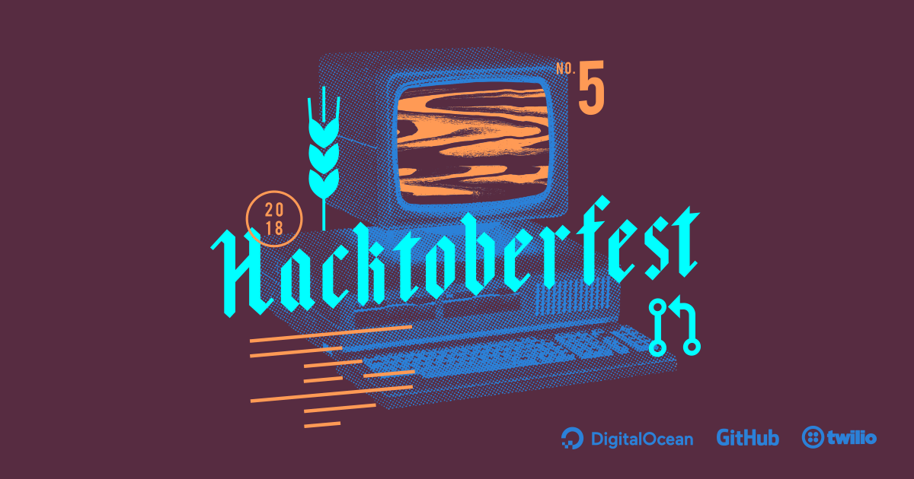
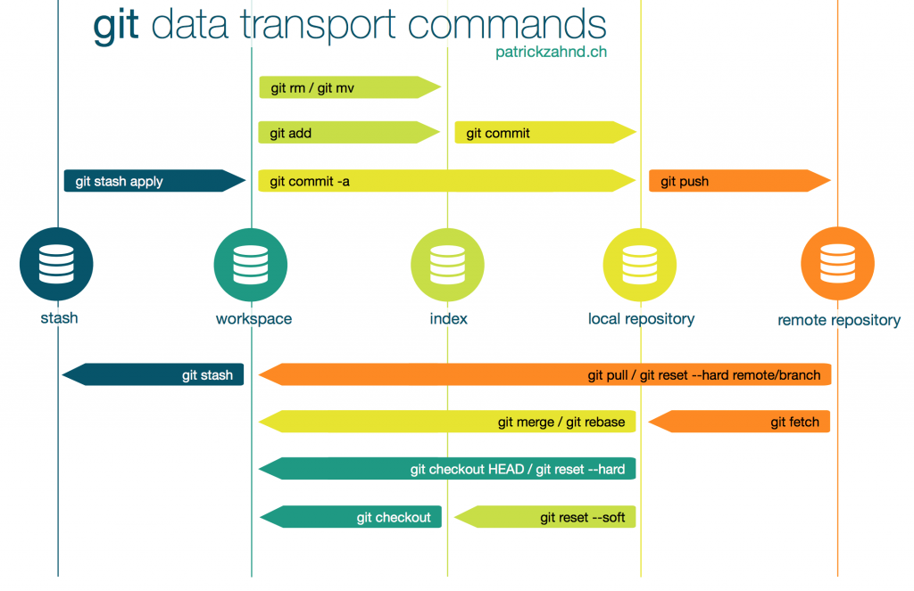
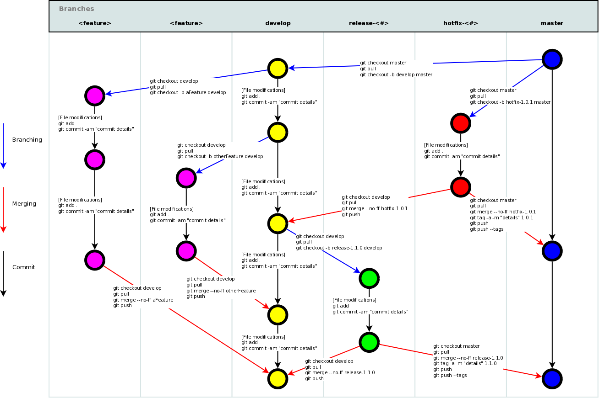
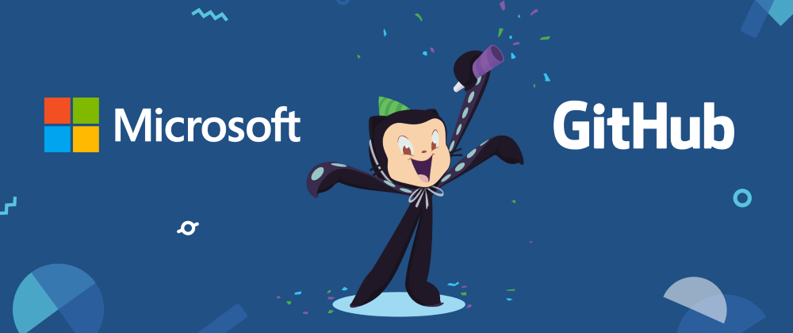
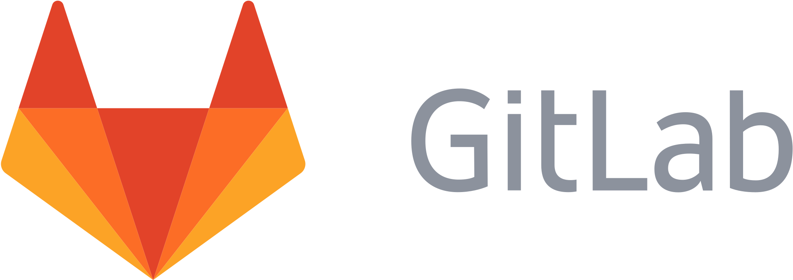
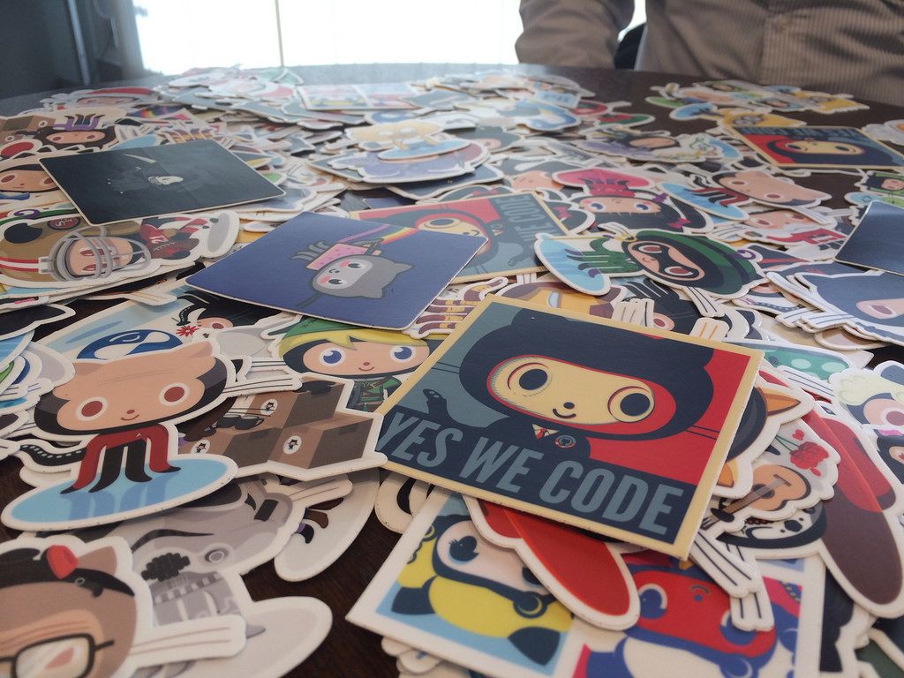

# Máster en Programación FullStack con JavaScript y Node.js
### JS, Node.js, Frontend, Backend, Firebase, Express, Patrones, HTML5_APIs, Asincronía, Websockets, Testing

## Clase 2


### Importante




### Control de Versiones

**Bienvenidos a la maquina del tiempo**
- Arquitectura de Árbol(working area, staging Area, Repository)
- Auditoria de código (quien? cuando? y que?)
- Git trabaja en binario (imagenes, docs, etc...)
- Git no guarda una copia de cada version, solo los cambios.
- Distribución (Repositorios y Clones)
- Opensource y funciona offline
- Consola vs. GUI

**Trabajo efectivo**

- [Clientes escritorio](https://mac.github.com)
- [Consola (Cheat-sheet)](https://services.github.com/on-demand/downloads/github-git-cheat-sheet.pdf)
- Repositorio
- Tracking
- Commits
- Sincronizar cambios
- Ramas
- Fork
- Clonación
- Pull-request
- Gestión de merges
- Público/Privado

**Working Flow**


### Github

- [Socializacion](https://guides.github.com/activities/socialize/)
	- Perfil
- Timeline Actividad
- [Colaborar](https://guides.github.com/activities/contributing-to-open-source/)
- [Compartir](https://guides.github.com/introduction/getting-your-project-on-github/)
- [Gist](https://gist.github.com/)
- [Issues](https://guides.github.com/features/issues)
- [Pages](https://guides.github.com/features/pages/)
- [Wikis](https://guides.github.com/features/wikis)


### Trabajando con Git

**Instalación**

Instalamos [Git - Source Code Management](http://git-scm.com/)

Comprobamos la instalación

```
git --version
```


**Bienvenidos a la maquina del tiempo**
- Arquitectura de Árbol(working area, staging Area, Repository)
- Auditoria de código (quien? cuando? y que?)
- Git trabaja en binario (imagenes, docs, etc...)
- Git no guarda una copia de cada version, solo los cambios.
- Distribución (Repositorios y Clones)
- Opensource y funciona offline
- Consola vs. GUI


**Trabajando en Local**

Configuración (entornos):

[Repositorios locales y remotos](../assets/clase2/6df35fb1-2c7e-4d2b-8db6-38c667c0dc2a.png)


- System (todos los usuarios)
    - git config --system
    - etc/gitconfig, /usr/local/git/etc/gitconfig

- Global (mi usuario)
    - git config --global
    - .gitconfig (usuario/root)

- Project (proyecto)
    - git config
    - /proyect/.git/config


**Comandos básicos**



versión
```
git --version
```

Grabando Nombre
```
git config --global user.name "nombre"
```

Comprobando el nombre
```
git config --global user.name
```

Grabando Email
```
git config --global user.email "email"
```

Habilitando colores
```
git config --global color.ui true
```

Ver usuarios en el equipo
```
git config --global --list
```


**GIT Working flow (local) - Básico**

- help (ayuda)

    - Ayuda general
    ```
    git config --global --list
    ```

    - Ayuda especifica
    ```
    git help push
    ```

    - Salir de la ayuda
    ```
    q (quit)
    ```

- init (arranque)
    - Buscamos la carpeta (ls, dir...)
    - Arrancando Git
    ```
    git init
    ```

- status
    - Verificar estado
    ```
    git status
    ```

- add
    - Añadiendo todo
    ```
    git add -A
    ```

    - Añadiendo todo *(como add -A, pero omite los archivos fuera de track)*
    ```
    git add .
    ```

    - Añadiendo un archivo especifico
    ```
    git add loquesea
    ```

- commit
    - Comentando el commit
    ```
    git commit -m "Mi primer commit"
    ```

- log
    - Verificando el estado de los commits
    ```
    git log
    ```

- reset (Reseteamos el proyecto hasta un punto dado (SIN RETORNO!))
    - No afecta al working area ni al Stagging Area, solo al repositorio
    ```
    git reset --soft NUMEROCOMMIT
    ```

    - No afecta al working area
    ```
    git reset --mixed NUMEROCOMMIT
    ```

    - Afecta a todos los niveles incluido el working area
    ```
    git reset --hard NUMEROCOMMIT
    ```

    - En caso de necesitar recuperación.
      Haz un reset --hard hacia delante, con el número del útimo commit.
      ```
      git reset --hard ULTIMOCOMMIT
      ```

    - Devolver un archivo de staging a working area
    ```
    git reset HEAD nombrearchivo
    ```    


**GIT Working flow (local) - Viajar en el tiempo**

- log
    - Hacemos una copia de seguridad de nuestros commits.
    ```
    git log > miscommits.txt
    ```

- checkout

    - Abrimos la maquina de tiempo
    ```
    git checkout NUMEROCOMMIT
    ```

    - Volvemos a Master
    ```
    git checkout master
    ```


**GIT Working flow (local) - Ramas (Branches)**

Ramas (Universos Paralelos)
*Línea master -> linea estable o principal.*
*Lineas secundarias -> lineas de desarrollo, bugs, experimentos, etc...*

- branch

    - Crear una rama
    ```
    git branch NOMBRERAMA
    ```

    - Ver ramas
    ```
    git branch
    ```    

    - Cambiar de rama
    ```
    git checkout NOMBRERAMA
    ```  

    - Ver cambios en formato ramas
    ```
    git log --oneline --graph --all
    ```  

    - Borrar una rama
    ```
    git branch -d NOMBRERAMA
    ```


**GIT Working flow (local) - Fusiones (básico)**

- Nos situamos en la rama que absorberá (principal)
    ```
    git checkout RAMAPRINCIAL
    ```

- Hacemos el *merge*
    ```
    git merge RAMASECUNDARIA
    ```

- Añadir comentario (o)

- Guardar y salir (:x)

- Ramas fusionadas
    ```
    git branch
    ```

- Borramos rama
    ```
    git branch -d NOMBRERAMA
    ```


**GIT Working flow (local) - Fusiones (gestión conflictos)**

  - Fast-forward (automatizado). No hay conflicto alguno.

    - Nos situamos en la rama que absorberá (principal)
    ```
    git checkout RAMAPRINCIAL
    ```

    - Hacemos el MERGE
    ```
    git merge RAMASECUNDARIA
    ```

    - Añadir comentario (o)

    - Guardar y salir (:x)


  - Manual Merge (Conflicto, dos personas tocaron los mismos archivos)

    - Nos situamos en la rama que absorberá (principal)
    ```
    git checkout RAMAPRINCIAL
    ```

    - Hacemos el MERGE
    ```
    git merge RAMASECUNDARIA
    ```

    - En consola
    ```
    Auto-merging CARPETA/ARCHIVO
    CONFLICT (content): Merge conflict in CARPETA/ARCHIVO
    Automatic merge failed; fix conflicts and then commit the result.
    ```

    - En el editor
    ```
    <<<<<<< HEAD
    hello world....!!!!!!!
    =======
    hello world 2 ..!!!
    >>>>>>> conflictiva
    ```

    - Resuelver y guardar
    ```
    hello world 2 ..!!!
    ```

    - Comprobamos el estado
    ```
    git status
    ```

    - commit para la resolución conflicto
    ```
    git commit -am "con este commit se arregla el conflicto"
    ```

    - Resultado
    ```
    *   81a6c1d con este commit se arregla el conflicto
    |\  
    | * 64b5518 que pasa
    * | 29a6348 ahora conflcito..no
    |/  
    * afe16ae Todo arriba..
    * 7c9cc50 Mi primer Commit
    ```

    - Borramos la rama (opcional)
    ```
    git branch -d NOMBRERAMA
    ```


**GITHUB Working flow (básico)**
  - clone
    - Clonar un proyecto ( [Bootstrap](https://github.com/twbs/bootstrap) )
    ```
    git clone https://github.com/twbs/bootstrap.git
    ```

  - log
    - Mirar los commits
    ```
    git log
    ```    


**GITHUB Working flow (Proyecto desde cero)**

  - Creamos los ficheros

  - init
    - monitorizamos los ficheros
    ```
    git init
    ```

  - commit
    - Añadimos los ficheros en un commit
    ```
    git commit -am "Mi primer proyecto"
    ```

  - remote
    - Enlazamos con Github
    ```
    git remote add origin <--HTTPoSSH-->
    ```

    - Comprobamos los detalles
    ```
    git remote -v
    ```

  - push
    - Mandamos los cambios
    ```
    git push origin master
    ```

**GITHUB Working flow (Proyecto en equipo)**
El proceso es igual, pero es necesario mantenerse sincronizado.

  - fetch
    - Actualizar *origin/master* (rama espejo en local)
    ```
    git fetch origin
    ```

  - merge
    - Fusionar *master* con *origin/master*
    ```
    git merge origin/master
    ```

  - commit
    - Preparamos un *commit* para subir un cambio a Github
    ```
    git commit -am "Nuevo cambio"
    ```

  - push
    - Subimos los cambios
    ```
    git push origin master
    ```


**GITHUB Working flow (Proyectos de terceros)**
*Usamos 2 repositorios (ORIGINAL EXTERNO (upstream/master) -> CLON ORIGINAL (origin/master) -> CLON LOCAL)*

  - remote
    - Conectamos al fork (origin)
    ```
    git remote add origin <--- HTTP --->
    ```

    - Verificamos la conexión
    ```
    git remote -v
    ```

    - Conectamos al remoto *(Upstream)*
    ```
    git remote add upstream HTTTPREPO-UPS
    ```

    - Verificamos que tenemos dos enlaces *(origin y upstream)*
    ```
    git remote -v
    ```

  - fetch
    - Comprobamos cambios en *origin*
    ```
    git fetch origin
    ```

    - Comprobamos cambios con *upstream*
    ```
    git fetch upstream
    ```

  - merge
    - Fusionamos *upstream* con local para actualizarnos
    ```
    git merge upstream/master
    ```

  - push
    - Subimos cambios a *origin*
    ```
    git push origin master
    ```

  - Subimos cambios al *upstream (pull-request)*


**GITHUB Working flow (GitHub Pages Manual)**
GitHub Pages nos permite hacer una web estática para nuestro usuario o proyectos

  - clone
    - Clonamos el repositorio
    ```
    git rclone <-- URL.git -->
    ```

  - checkout --orphan
    - Creamos una rama huérfana
    ```
    git checkout --orphan gh-pages
    ```

  - rm
    - Borramos todos los archivos del directorio
    ```
    git rm --rf .
    ```

  - add
    - Creamos nuestro index.html y lo añadimos
    ```
    echo "Bienvenido a gh-pages" > index.html
    git add index.html
    ```

  - commit
    - Preparamos un commit para subir el index a Github
    ```
    git commit -am "Nuevo cambio"
    ```

  - push
    - Subimos el cambio
    ```
    git push origin gh-pages
    ```


**GITHUB Avanzado (Trucos)**


  - branch
    - Renombrar rama
    ```
    git branch -m NOMBRERAMA NOMBRERAMANUEVO
    ```

    - Mostrando todas las ramas (incluido espejos)
    ```
    git branch -a
    ```

  - add + commit
    - am
    ```
    git commit -am "Texto"
    ```

  - config
    - Usando un alias
    ```
    git config --global alias.NOMBREALIAS 'COMANDO'
    git config --global alias.buenlog 'log --oneline --graph --all'
    git buenlog
    ```

  - pull
    - fecht + merge
    ```
    git pull
    ```

  - diff
    - Ver lo que has modificado pero aún no has preparado
    ```
    git diff
    ```

    - Ver los cambios que has preparado y que irán en tu próxima confirmación
    ```
    git diff --cached
    ```

### Trabajando con C9.io

- [Setup Git and basic commands](http://git-scm.com/book/es/v1/Empezando-Configurando-Git-por-primera-vez)

**Escenarios básicos:**

**Quiero subir algo a Github**

1. Verificamos el estado en general.
 ```
git status
 ```

2. Nos actualizamos.
 ```
git pull
 ```

3. Preparamos nuestro commit (añadimos archivos y añadimos la información adicional)
 ```
git add "ARCHIVO"
git commit -m "MENSAJE..."
 ```

4. Actualizamos y enviamos los cambios a Github
 ```
git pull && git push
 ```

**No quiero subir nada a Github, pero quiero estar actualizado**

1. Nos actualizamos.
 ```
git pull
 ```

**Trucos:**

- Para cachear las credenciales y evitar que nos pida usuario y contraseña constantemente:

```
git config --global credential.helper 'cache --timeout=9999999'
```
Git cacheará la sesión y no os preguntará el usuario o la password durante 9999999ms (2,7h), o el tiempo que pidamos.
Recuerda que debes incluir este comando antes de tu próximo *git push*


### Github API

- [Git Awards](http://git-awards.com/)
- [Documentación](https://developer.github.com/v3/)
- [https://api.github.com/users/{user}](https://api.github.com/users/ulisesGascon)
- [https://api.github.com/users/{user}/orgs](https://api.github.com/users/UlisesGascon/orgs)
- [https://api.github.com/users/{user}/events](https://api.github.com/users/UlisesGascon/events)
- [https://api.github.com/users/{user}/repos](https://api.github.com/users/osweekends/repos)
- [https://api.github.com/repos/{user}/{repo}](https://api.github.com/repos/OSWeekends/c9scripts)

### Resumen

[tamaño original](../assets/clase2/0b734102-cb02-4dfd-89d3-faf0b7a97880.png)


### Git Drama: Microsfot compró Github



- [Con la compra de GitHub, Microsoft hace honor a su mantra: desarrolladores, desarrolladores, desarrolladores](https://www.xataka.com/aplicaciones/microsoft-punto-adquirir-github-desarrolladores-desarrolladores-desarrolladores)
- [Confirmado: Microsoft compra GitHub por 7.500 millones de dólares](https://www.genbeta.com/actualidad/confirmado-microsoft-compra-github-7-500-millones-dolares)
- [El nuevo CEO de GitHub responde a los usuarios en Reddit: "La vieja Microsoft tenía miedo del open source"](https://www.genbeta.com/a-fondo/nuevo-ceo-github-responde-usuarios-reddit-vieja-microsoft-teni-miedo-open-source)
- [Ante la paranoia, Microsoft promete que GitHub se mantendrá independiente y abierto](https://www.genbeta.com/actualidad/paranoia-microsoft-promete-que-github-se-mantendra-independiente-abierto)
- [What I think is bad about Microsoft acquiring GitHub](https://dev.to/maxart2501/what-i-think-is-bad-about-microsoft-acquiring-github-gme)
- [Microsoft acquiring GitHub is a good thing. Here’s why.](https://medium.com/@ow/microsoft-acquiring-github-is-a-good-thing-heres-why-6a6a57eb83ac)
- [Microsoft has reportedly acquired GitHub. Good or bad?](https://www.reddit.com/r/Lisk/comments/8ogj1z/microsoft_has_reportedly_acquired_github_good_or/)
- [What is wrong with Microsoft buying GitHub](https://news.ycombinator.com/item?id=17225599)
- [What Microsoft buying GitHub means to open-source software development](https://www.zdnet.com/article/what-microsoft-buying-github-means-to-open-source-software-development/)
- [Microsoft Buys GitHub and FOSS Fans Aren’t Happy](https://www.omgubuntu.co.uk/2018/06/microsoft-buying-github)
- [Microsoft's Interest In Buying GitHub Draws Backlash From Developers](https://developers.slashdot.org/story/18/06/04/0935200/microsofts-interest-in-buying-github-draws-backlash-from-developers)
- [Microsoft is buying GitHub, but will the open source world follow?](http://www.wired.co.uk/article/microsoft-github-deal-open-source)
- [How will Microsoft handle github's controversial code?](https://www.wired.com/story/microsoft-github-code-moderation/)
- [Microsoft’s github deal is its latest shift from Windows](https://www.wired.com/story/microsofts-github-deal-is-its-latest-shift-from-windows/)


### Los principales jugadores


- [GitHub vs. Bitbucket vs. GitLab vs. Coding](https://medium.com/flow-ci/github-vs-bitbucket-vs-gitlab-vs-coding-7cf2b43888a1)
- [The Key Differences : GitLab vs GitHub vs bitbucket](https://medium.com/@ramoliya/the-key-differences-gitlab-vs-github-vs-bitbucket-3d76c4bcf5e6)
- [GitHub vs. Bitbucket vs. GitLab](https://stackshare.io/stackups/bitbucket-vs-github-vs-gitlab)
- [GitHub vs. GitLab vs. Bitbucket: ¿Que repositorio elegir?](http://www.clubdetecnologia.net/blog/2017/github-vs-gitlab-vs-bitbucket-que-repositorio-elegir/)
- [The Key Differences : GitLab vs GitHub vs bitbucket](https://www.linkedin.com/pulse/key-differences-gitlab-vs-github-bitbucket-muhammad-arslan-ali/)
- [GitHub vs. GitLab vs. Bitbucket: Which code repo should you choose?](https://jaxenter.com/github-gitlab-bitbucket-code-repo-138308.html)

### Terminología


### Gitlab



**Recursos**
- [Canal oficial de Youtube](https://www.youtube.com/channel/UCnMGQ8QHMAnVIsI3xJrihhg)
- [GitLab Web](https://gitlab.com/)
- [GitLab Web | Product](https://about.gitlab.com/product/)
- [GitLab Web | Pricing](https://about.gitlab.com/pricing/)
- [GitLab Web | Instalation](https://about.gitlab.com/installation/)
- [GitLab Web | Community](https://about.gitlab.com/community/)
- [GitLab Web | Blog](https://about.gitlab.com/blog/)
- [GitLab Web | Contact](https://about.gitlab.com/contact/)
- [GitLab | Explore](https://gitlab.com/explore)
- [GitLab | Snippets](https://gitlab.com/explore/snippets)
- [GitLab | Groups](https://gitlab.com/explore/groups)
- [GitLab Help](https://gitlab.com/help)
- [GitLab Help | User Doc](https://gitlab.com/help/user/index.md)

**Otros**
- [@gitlab en Twitter](https://twitter.com/gitlab?lang=es)
- [GitLab Videos | Inside GitLab](https://www.youtube.com/playlist?playnext=1&list=PLFGfElNsQthaTiOCAdtyZ6zN39d3Q1_cG&index=1)
- [GitLab Videos | Demos](https://www.youtube.com/watch?v=7QXhH4WGLfc&list=PLFGfElNsQthYv5OtNEFoGwd0cAg-55Hdj&index=1)
- [GitLab Videos | How-to](https://www.youtube.com/watch?v=HPMjM-14qa8&list=PLFGfElNsQthapNLLeup0kkFskB6aHxFyJ&index=1)
- [GitLab en Wikipedia](https://en.wikipedia.org/wiki/GitLab)
- [GitLab ahora ofrece sus planes de pago (de hasta 99 dólares al mes) completamente gratis para proyectos open source y escuelas](https://www.genbeta.com/actualidad/gitlab-ahora-ofrece-sus-planes-pago-99-dolares-al-mes-completamente-gratis-para-proyectos-open-source-escuelas)
- [Qué es GitLab y por qué tanta gente huye a él tras la compra de GitHub por parte de Microsoft](https://www.genbeta.com/herramientas/que-gitlab-que-tanta-gente-huye-el-compra-github-parte-microsoft)
- [GitLab, la alternativa a GitHub a la que están migrando los desarrolladores temerosos de Microsoft](https://www.xataka.com/makers/microsoft-ha-comprado-github-muchos-desarrolladores-estan-marchandose-gitlab)


### Bitbucket


**Recursos**
- [@bitbucket en Twitter](https://twitter.com/bitbucket)
- [Bitbucket](https://bitbucket.org/)
- [Bitbucket | Blog](https://blog.bitbucket.org/)
- [Bitbucket | API](https://developer.atlassian.com/bitbucket)
- [Bitbucket | Bitbucket Cloud documentation](https://confluence.atlassian.com/bitbucket/bitbucket-cloud-documentation-221448814.html)
- [Bitbucket | Features](https://bitbucket.org/product/features)
- [Bitbucket | Plans & Pricing](https://bitbucket.org/product/pricing)


**Otros**
- [How to move private repositories from Github to Bitbucket](https://befused.com/git/github-bitbucket-move)
- [Moving from GitHub to Bitbucket – Why and How](https://www.topdraw.com/blog/moving-from-github-to-bitbucket-why-and-how/)
- [Migrate all your private github repos to bitbucket because you're CHEAP.](https://gist.github.com/schwa/5907109)
- [Trello Is Being Acquired By Atlassian](https://blog.trello.com/trello-atlassian)
- [Confessions of a Git wallflower, and other stories about Bitbucket](https://www.atlassian.com/blog/bitbucket/bitbucket-awesome-for-git-beginners-and-students)
- [10 reasons why teams are switching from GitHub to Bitbucket after Microsoft acquisition](https://blog.bitbucket.org/2018/06/04/10-reasons-teams-switching-github-bitbucket-microsoft-acquisition/)


**Ecosistema**
- [Trello](https://www.atlassian.com/software/trello)
- [Trello | Inspiration](https://trello.com/inspiration)
- [Trello | Guide](https://trello.com/guide)
- [Trello | Pricing](https://trello.com/pricing)
- [Jira](https://es.atlassian.com/software/jira)
- [Jira | Features](https://es.atlassian.com/software/jira/features)
- [StatusPage](https://www.atlassian.com/software/statuspage)
- [Hipchat](https://www.atlassian.com/software/hipchat)
- [Bamboo](https://www.atlassian.com/software/bamboo)
- [Sourcetree](https://www.atlassian.com/software/sourcetree)
- [Confluence](https://www.atlassian.com/software/confluence)
- [Stride](https://www.atlassian.com/software/stride)


### Ejercicios




**1 -** Creamos una cuenta en Github y creamos un workespace con referencia a nuestro repositorio de GitHub en [c9.io](https://c9.io/) una vez hayamos recibido la invitación.

**2 -** Sube tu código a GitHub
- Crea una carpeta en el repositorio con tu nombre.
- Una subcarpeta *pública* y otra *privada*
- Crea un archivo *Hello Word* usando [Markdown](https://guides.github.com/features/mastering-markdown/)
- Comparte la tu carpeta *pública* con todos nosotros en GitHub

**2 -** Crea un [Gist](https://gist.github.com/) con el esqueleto de un index.html

**3 -** Presentate en este [issue](https://github.com/Fictizia/Master-en-Programacion-FullStack-con-JavaScript-y-Node.js_ed3/issues/1)
